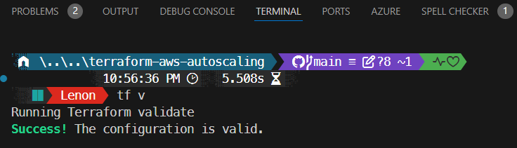

# Automating Infrastructure with Terraform and Auto Scaling


## Overview

In this project, we will automate infrastructure deployment using **Terraform** in combination with **AWS Auto Scaling**. The setup includes:

- An **Auto Scaling Group** spanning multiple subnets  
- **Security Groups** to control network traffic  
- An **EC2 Launch Template** pre-configured with an **Apache Web Server**  
- An **S3 bucket backend** for storing the Terraform State file  / but for this project I will leverage **terraform cloud** as my backend.

By leveraging **Terraform**, we ensure scalability, automation, and significant time savings. Let’s dive in! 🚀  

---

## Prerequisites

Before getting started, ensure you have the following:

- **Terraform v1.x.x** – [Download here](https://www.terraform.io/downloads)  
- **AWS CLI** – [Installation Guide](https://docs.aws.amazon.com/cli/latest/userguide/install-cliv2.html)  
- **Existing AWS Key Pair** for SSH access  
- **Pre-existing S3 Bucket** for backend storage  /  I will leverage **terraform cloud** as my backend.

To create an **S3 bucket** for storing the Terraform state file, you can run:

```bash
aws s3api create-bucket --bucket your-terraform-backend-bucket --region us-east-1
```

## Project Structure

Organize your Terraform project with the following file structure:

```bash
├── main.tf          # Defines ASG, Security Groups, and Launch Templates
├── variables.tf     # Declares input variables for flexibility
├── providers.tf     # Configures the AWS provider
├── userdata.sh      # Bootstraps EC2 instances with Apache Web Server

```

- visit my **[githubrepo](https://github.com/lnformbu/terraform-aws-autoscaling)** to get the code for the above terraform files.

## Requirements

| Name | Version |
|------|---------|
| <a name="requirement_terraform"></a> [terraform](#requirement\_terraform) | >= 1.7.0 |
| <a name="requirement_aws"></a> [aws](#requirement\_aws) | >= 4.66, < 5.67.0 |

## Providers

| Name | Version |
|------|---------|
| <a name="provider_aws"></a> [aws](#provider\_aws) | >= 4.66, < 5.67.0 |

## Modules

No modules.

## Resources

| Name | Type |
|------|------|
| [aws_autoscaling_group.web_autosg](https://registry.terraform.io/providers/hashicorp/aws/latest/docs/resources/autoscaling_group) | resource |
| [aws_launch_template.web_lunt](https://registry.terraform.io/providers/hashicorp/aws/latest/docs/resources/launch_template) | resource |
| [aws_security_group.web_secg](https://registry.terraform.io/providers/hashicorp/aws/latest/docs/resources/security_group) | resource |
| [aws_subnets.this](https://registry.terraform.io/providers/hashicorp/aws/latest/docs/data-sources/subnets) | data source |
| [aws_vpc.this](https://registry.terraform.io/providers/hashicorp/aws/latest/docs/data-sources/vpc) | data source |

## Inputs

| Name | Description | Type | Default | Required |
|------|-------------|------|---------|:--------:|
| <a name="input_ami_id"></a> [ami\_id](#input\_ami\_id) | n/a | `string` | `"ami-0c02fb55956c7d316"` | no |
| <a name="input_bucket_name"></a> [bucket\_name](#input\_bucket\_name) | n/a | `string` | `"luit-terraform-proj2-backend"` | no |
| <a name="input_instance_type"></a> [instance\_type](#input\_instance\_type) | n/a | `string` | `"t2.micro"` | no |
| <a name="input_key_name"></a> [key\_name](#input\_key\_name) | n/a | `string` | `"test"` | no |
| <a name="input_max_size"></a> [max\_size](#input\_max\_size) | n/a | `number` | `5` | no |
| <a name="input_min_size"></a> [min\_size](#input\_min\_size) | n/a | `number` | `2` | no |
| <a name="input_region"></a> [region](#input\_region) | n/a | `string` | `"us-east-1"` | no |

## Outputs

No outputs.

---

## Validate, Intialize, plan and Deploy

**Before deploying, ensure your Terraform configuration is correct by running:**

```bash
terraform validate  # Checks for syntax errors and misconfigurations
```



**Validate Terraform Cloud Backend**

Since we are using **Terraform Cloud** as the backend, ensure Terraform is correctly configured by running:

```bash
terraform init  # Initializes Terraform and connects to the Terraform Cloud backend
```


- Once validated, initialized and planned, apply the configuration to provision resources:

```bash
terraform apply -auto-approve  # Deploys infrastructure as defined in Terraform code

```


**let's check our terraform cloud**


**visit the console and make sure all resources  are well configured**

- Check the Auto Scaling group is created


## Manually Deleting an Instance

To remove a specific EC2 instance, run the following command, replacing `<instance-id>` with the actual instance ID:

```bash
aws ec2 terminate-instances --instance-ids i-00a23e3a0290ff153
```


**Test that Apache Web server is running with our custom userdata script**


**run Terraform destroy command to save on cost once completed**

```bash
terraform destroy --auto-approve
```


